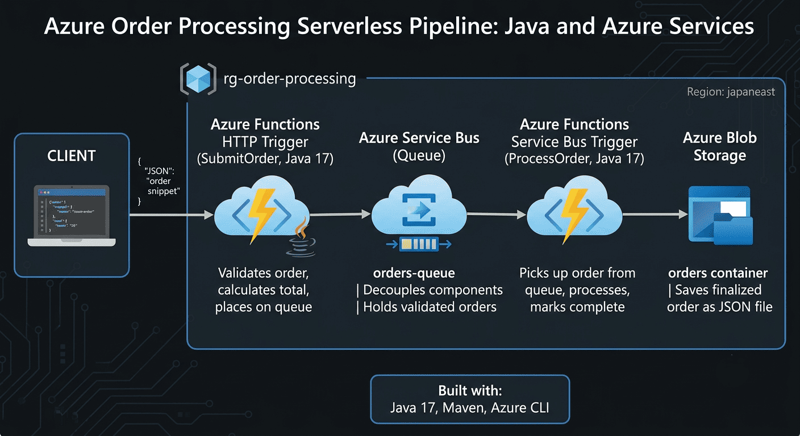
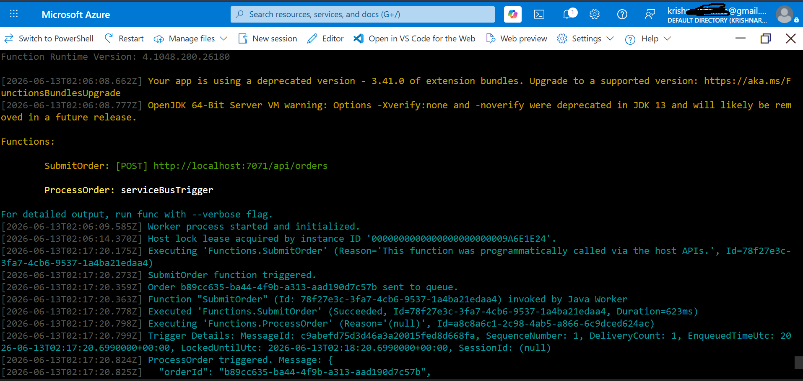
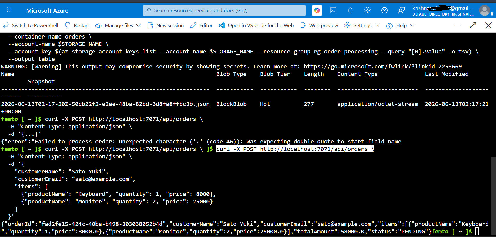
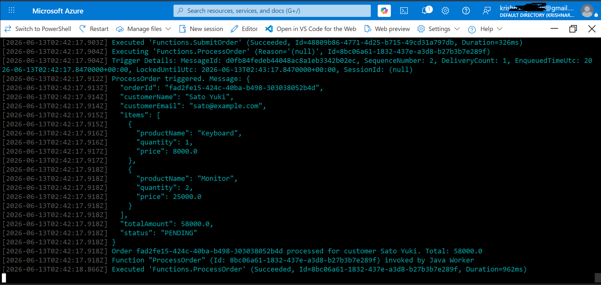
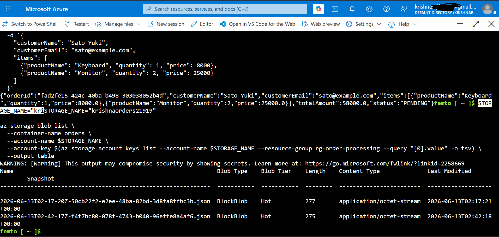
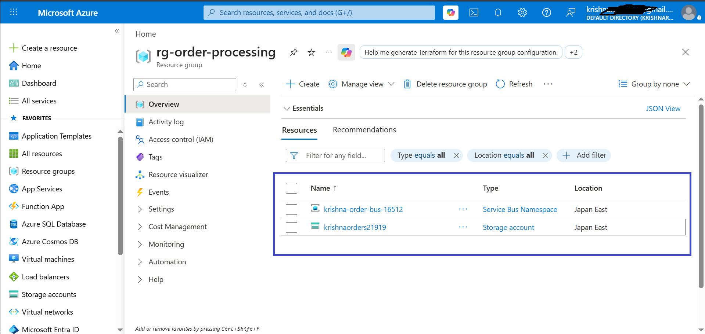

# Azure Order Processing — Serverless Pipeline

**Languages:** [English](README.md) | [日本語](README.jp.md)

---

## What this is

A small order-processing system built with Java and Azure Functions. When someone places an order, it gets validated, queued, and then processed in the background — the kind of pattern you'd see in a real e-commerce backend.

I built this to get hands-on practice with Azure serverless services after working mainly with AWS before.

## How it works



1. A client sends an order (customer info + items) to an HTTP endpoint
2. The `SubmitOrder` function checks the order, calculates the total price, and puts it on a Service Bus queue
3. The `ProcessOrder` function picks it up from the queue, marks it as processed, and saves it as a JSON file in Blob Storage

The two functions don't talk to each other directly — they're connected only through the queue. This means the order is accepted right away, and the processing happens separately in the background.

## Tech used

- Java 17
- Azure Functions (HTTP trigger + Service Bus trigger)
- Azure Service Bus (queue)
- Azure Blob Storage
- Maven
- Azure CLI for setting up the resources

## Screenshots

**Functions running locally**


**Sending an order**


**Order moving through the pipeline (queue → processing)**


**Saved order files in Blob Storage**


**Resources in Azure**


## Running it yourself

Set up the Azure resources:

```bash
az group create --name rg-order-processing --location japaneast

az storage account create --name <storage-name> \
  --resource-group rg-order-processing --location japaneast --sku Standard_LRS

az servicebus namespace create --name <servicebus-name> \
  --resource-group rg-order-processing --location japaneast --sku Basic

az servicebus queue create --name orders-queue \
  --namespace-name <servicebus-name> --resource-group rg-order-processing

az storage container create --name orders \
  --account-name <storage-name> --account-key <key>
```

Copy `local.settings.json.example` to `local.settings.json` and fill in your connection strings.

Then:

```bash
mvn clean package
mvn azure-functions:run
```

Test it:

```bash
curl -X POST http://localhost:7071/api/orders \
  -H "Content-Type: application/json" \
  -d '{
    "customerName": "Tanaka Taro",
    "customerEmail": "tanaka@example.com",
    "items": [
      {"productName": "Laptop", "quantity": 1, "price": 150000},
      {"productName": "Mouse", "quantity": 2, "price": 2500}
    ]
  }'
```

## A few notes on how it's built

- The total price is calculated on the server, not trusted from the client — otherwise someone could send a fake total
- Click counts and similar updates use an atomic database update instead of read-then-write, so concurrent requests don't overwrite each other (not used in this exact project, but it's the same principle applied here for order processing)
- The queue separates "accepting an order" from "processing an order" — if processing takes longer or fails, it doesn't block the customer's request

## Notes

- Built and tested using Azure's free tier
- Resources were deleted after testing to avoid any charges

## Author

Krishnaraj Ramachandran — [GitHub](https://github.com/krishfemto)
